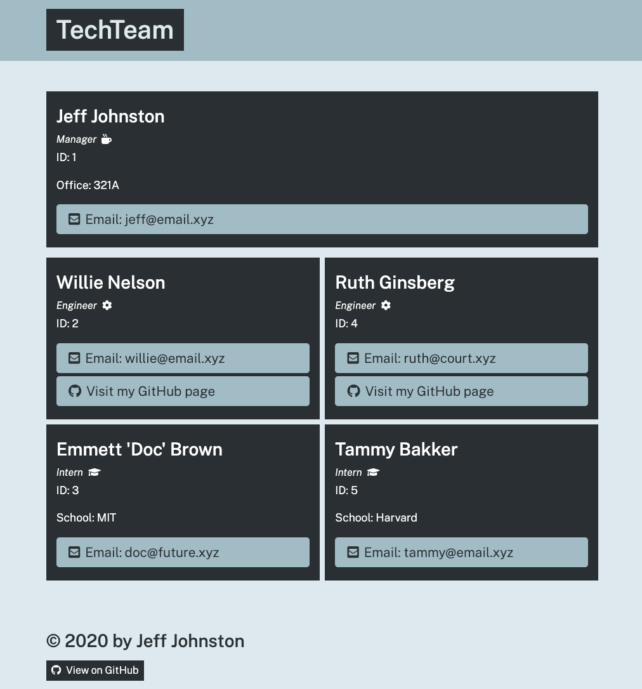

# Team Profile Generator

## Description 
Team Profile Generator is an interactive, Node.js-driven application that captures user input via npm Inquirer. The data is then harnessed to dynamically render development team data to an html page linked to a developer-provided, default stylesheet.

## Table of Contents
* [Installation](#installation) 
* [Usage](#usage) 
* [License](#license) 
* [Contributing](#contributing)
* [Tests](#tests)  
* [Questions](#questions)

 
### Installation
  Clone or fork the code from the Team-Profile-Generator repository on GitHub. Open the code in a standard code editing application, such as VS Code.
### Usage
 Open an intregrated terminal and type the command "node index.js." Follow the prompts to generate your custom team profile page!
### License
  MIT
### Contributing
Generator is an open source project, and anyone is encourged to contribute by cloning or forking the code and working to improve its function and versatility.

### Tests
Try skipping questions that say they are required. Try answering both yes and no to the confirmation prompts to ensure the expected outcome is obtained. Try skipping optional questions and make sure their respective categories do not show up in the dynamically created table of contents.

### Questions
    
##### Interested in other projects from this developer? Visit the following GitHub profile:
https://github.com/jeffwjohn
    
##### Send any questions to the following email address:
jeffwjohn@yahoo.com

##### View a demonstration video at the following link:
https://drive.google.com/file/d/1B1P_hdYJBgLxeWMhoLdQLawT2FEwPOj_/view
    
    
